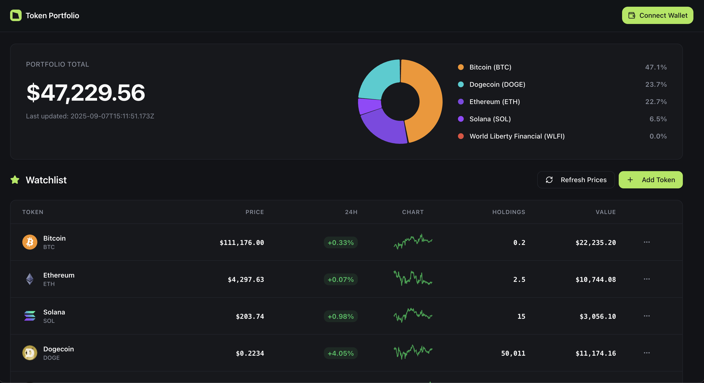

# Token Portfolio



## Overview

A modern cryptocurrency portfolio tracker built with React and TypeScript. Features real-time price tracking, interactive charts, wallet integration, and responsive design matching Figma specifications.

## Features

- **Portfolio Overview**: Interactive donut chart showing token allocation
- **Watchlist Management**: Add, remove, and track cryptocurrency tokens
- **Live Price Updates**: Real-time data from CoinGecko API with 7-day sparklines
- **Wallet Integration**: Connect wallets using RainbowKit (Ethereum, Polygon, Optimism, Arbitrum, Base)
- **Editable Holdings**: Click to edit token amounts with instant portfolio recalculation
- **Data Persistence**: Portfolio data saved in localStorage
- **Responsive Design**: Mobile-optimized layout with dark theme
- **Search & Trending**: Search tokens or browse trending cryptocurrencies

## Tech Stack

- **Frontend**: React 18, TypeScript, Vite
- **State Management**: Redux Toolkit
- **Styling**: Tailwind CSS, shadcn/ui
- **Charts**: Chart.js, React Chart.js 2
- **Wallet**: wagmi, RainbowKit
- **API**: CoinGecko API v3

## Setup

```bash
# Clone repository
git clone https://github.com/basedavishkar/token-portfolio.git
cd token-portfolio

# Install dependencies
npm install

# Start development server
npm run dev

# Build for production
npm run build
```

Open `http://localhost:5173` in your browser.

## Deployment

### Vercel (Recommended)
1. Push code to GitHub
2. Import repository in Vercel
3. Deploy automatically

### Netlify
1. Run `npm run build`
2. Upload `dist/` folder to Netlify

### Environment Variables
```env
VITE_WALLETCONNECT_PROJECT_ID=your_project_id
```
